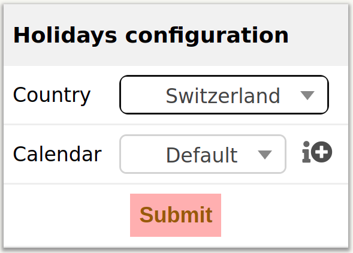
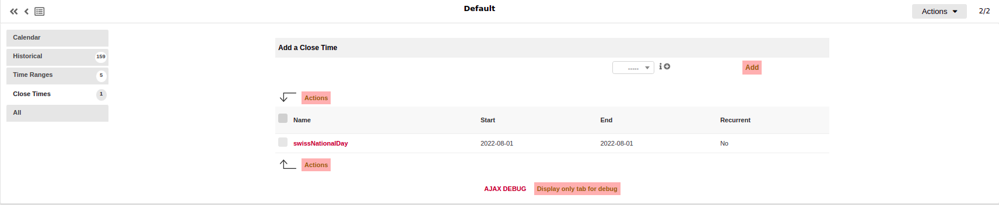

# Holidays GLPI/ITSM-NG plugin

This plugin allows to set holidays from over 40 countries.

## Usage

Go to the config of Holidays plugin and select your country and also your calendar.
When you have done it just press the submit button and voila, all the holidays are set to your calendar.

## Installation

Go to your plugin folder from itsm-ng folder, put file on it and extract him.
